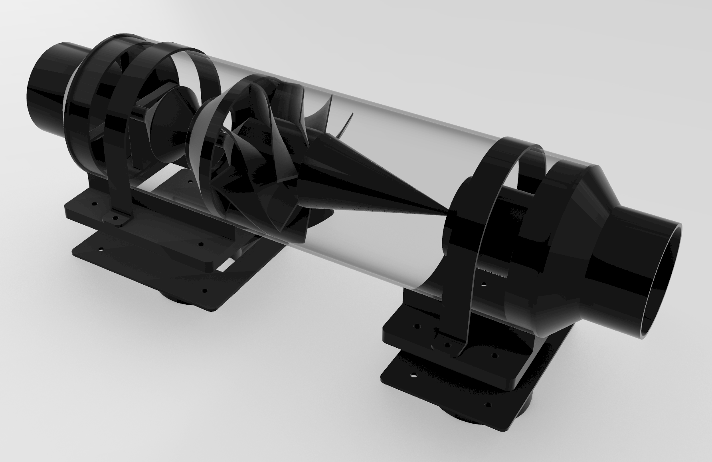
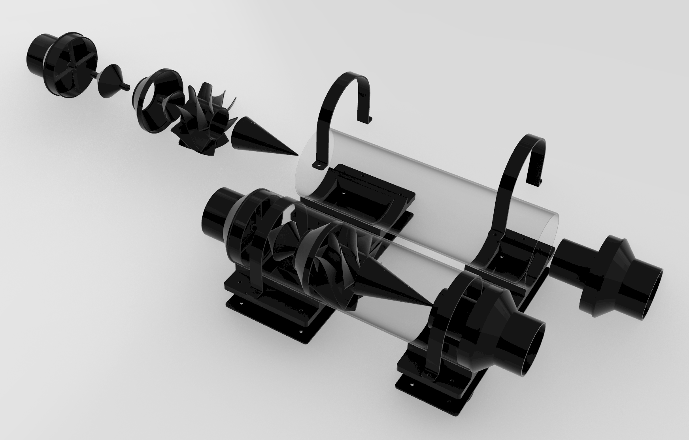

# Centrifugal Dust Separator - 3D Printer Files
The centrifugal dust separator is inspired by the commercial systems which use a centrifugal dust extraction process to clean the air.  These files will allow you to 3D print all the necessary pieces to build your own system.  Simply download the files, import into your favorite slicer, choose your favorite filament, and grab a 6" PVC tube.

Cut Tube Length to: 19-1/4"

Files are numbered in the general order of assembly.  They have been exported in mm.

Check out the build video [here](https://youtu.be/R4R9GfCQrW4).

Note: If you're only using one separator and your reducing from the 5" to 4" inlet, print file 14.  If you're using the 5" to 4" Y-fitting for a dual separator, print file 15.

A lot of work goes into these designs.  Additionally, all of the guitars that we build in our workshop are donated.  Please consider a donation.  All money collected goes to the materials needed for the next donated guitar.  Thanks!

